# Agrupació Folklòrica Igualadina - Website

Lloc web oficial de l'Agrupació Folklòrica Igualadina, entitat dedicada a preservar i difondre la cultura popular i tradicional catalana des de 1940.

## 🌐 Estructura del lloc web

```mermaid
graph TD
    A[🏠 Inici /] --> B[📚 Història /història]
    A --> C[🎭 Espectacles /espectacles]
    A --> D[🎓 Escola de Dansa /escola-de-dansa]
    A --> E[📅 Calendari /calendari]
    A --> F[📞 Contacte /contacte]
    A --> G[📸 Galeria /galeria]
    
    A --> H[📰 Blog Posts]
    H --> H1[Ballada a Maians]
    H --> H2[Espectacle Les 4 Estacions]
    H --> H3[Festival contra el càncer infantil]
    H --> H4[Roda d'Esbarts]
    H --> H5[... més notícies]
    
    D --> D1[👶 Infantils 4-8 anys]
    D --> D2[🧒 Juvenils 9-16 anys]
    D --> D3[💃 Cos de Dansa 17-45 anys]
    D --> D4[👴 Veterans 45+ anys]
    
    G --> G1[🎪 Espectacles]
    G --> G2[🎭 Actuacions]
    G --> G3[🤝 Trobades]
    
    F --> F1[📧 Formulari de contacte]
    F --> F2[📍 Informació d'ubicació]
    F --> F3[🌐 Xarxes socials]
    
    style A fill:#2d8659,stroke:#fff,stroke-width:3px,color:#fff
    style D fill:#4a9d6b,stroke:#fff,stroke-width:2px,color:#fff
    style G fill:#7bc092,stroke:#fff,stroke-width:2px,color:#fff
    style F fill:#4a9d6b,stroke:#fff,stroke-width:2px,color:#fff
```



## 🎨 Característiques del disseny

- **Tema personalitzat**: Disseny completament personalitzat sense dependències de temes externs
- **Paleta de colors verda**: Inspirada en la natura amb tons verds càlids
- **Responsive**: Adaptat a tots els dispositius i pantalles
- **Animacions**: Efectes suaus d'entrada i hover
- **Imatges**: Sistema de galeria amb placeholders del logo AFI

## 📁 Estructura de fitxers

```
agrupaciofolkloricaigualadina/
├── _layouts/
│   ├── default.html      # Layout base amb navegació i banner
│   ├── home.html         # Layout de la pàgina d'inici
│   ├── page.html         # Layout per pàgines estàtiques
│   └── post.html         # Layout per articles del blog
├── _includes/
│   ├── head.html         # Meta tags i enllaços CSS/fonts
│   ├── banner.html       # Banner superior amb logo
│   ├── navigation.html   # Menú de navegació responsive
│   └── footer.html       # Peu de pàgina amb informació
├── _posts/               # Articles del blog
├── _sass/                # Fitxers SCSS (buit, tot a style.scss)
├── assets/
│   ├── css/
│   │   └── style.scss    # Tots els estils personalitzats
│   └── images/
│       └── logo_afi.jpg  # Logo de l'agrupació
├── index.markdown        # Pàgina d'inici
├── 01_història.markdown  # Pàgina de la història
├── 02_espectacles.markdown # Pàgina d'espectacles
├── 03_escola-de-dansa.markdown # Pàgina de l'escola
├── 04_calendari.markdown # Pàgina del calendari
├── 05_contacte.markdown  # Pàgina de contacte
├── galeria.markdown      # Galeria d'imatges
├── favicon.ico          # Icona del lloc web
└── _config.yml          # Configuració de Jekyll
```

## 🚀 Tecnologies utilitzades

- **Jekyll**: Generador de llocs estàtics
- **SCSS**: Preprocessador CSS amb variables personalitzades
- **HTML5**: Estructura semàntica
- **JavaScript**: Interaccions i animacions
- **Formspree**: Processament de formularis de contacte
- **Google Fonts**: Tipografia Inter

## 📱 Funcionalitats

### 🏠 Pàgina d'inici
- Banner atractiu amb logo i descripció
- Secció de notícies recents
- Galeria d'imatges destacades
- Crida a l'acció per contactar

### 🎓 Escola de Dansa
- Informació detallada de cada grup d'edat
- Horaris i descripcions
- Targetes visuals per cada categoria
- Informació sobre danses que s'ensenyen

### 📅 Calendari
- Horaris setmanals d'assajos
- Esdeveniments i activitats mensuals
- Sistema de tags per categoritzar esdeveniments
- Informació d'ubicació i logística

### 📞 Contacte
- Formulari de contacte estilitzat
- Informació completa de contacte
- Enllaços a xarxes socials
- Indicacions per arribar al local

### 📸 Galeria
- Grid responsive d'imatges
- Efectes hover amb informació
- Categorització per tipus d'esdeveniment
- Navegació per anys

## 🎨 Paleta de colors

```scss
:root {
    --primary-green: #2d8659;   // Verd principal
    --accent-green: #4a9d6b;    // Verd accent
    --light-green: #7bc092;     // Verd clar
    --pale-green: #e8f5ee;      // Verd molt clar
    --cream-white: #fefffe;     // Blanc trencat
    --warm-gray: #5a6b5d;       // Gris càlid
    --dark-text: #2c3e30;       // Text fosc
    --border-green: #b8d4c6;    // Verd per vores
}
```

## 📐 Layout i marges

- **Amplada màxima de contingut**: 1000px (marges amplis)
- **Padding lateral**: 3rem en desktop, 1.5rem en mòbil
- **Border radius**: 15-20px per elements moderns
- **Espaiats**: Sistema consistent amb múltiples de 1rem

## 🖼️ Gestió d'imatges

Actualment, totes les imatges utilitzen `logo_afi.jpg` com a placeholder. Per afegir imatges reals:

1. Pujar imatges a `assets/images/`
2. Actualitzar les referències en els fitxers markdown i layouts
3. Mantenir les mides recomanades:
   - Banner: 600x300px
   - Galeria: 400x250px
   - Thumbnails: 120x80px

## 🛠️ Desenvolupament local

```bash
# Instal·lar dependències
bundle install

# Construir el lloc
bundle exec jekyll build

# Servir localment
bundle exec jekyll serve
```

El lloc estará disponible a `http://localhost:4000`

## 📝 Configuració

Els paràmetres principals es poden modificar a `_config.yml`:

```yaml
title: Agrupació Folklòrica Igualadina
email: info@agrupaciofolkloricaigualadina.cat
description: >-
  L'agrupació Folklòrica Igualadina és una entitat de dansa tradicional 
  igualadina que propaga la cultura popular i tradicional des de 1940.
url: ""
twitter_username: afi
instagram_username: afi
github_username: afi
```

## 🎯 Pròximes funcionalitats

- [ ] Integració amb Google Maps per la ubicació
- [ ] Lightbox per la galeria d'imatges
- [ ] Sistema de cerca per articles
- [ ] Multiidioma (català/castellà)
- [ ] Integració amb calendari Google
- [ ] Newsletter automatitzat

---

*Desenvolupat amb ❤️ per preservar la cultura folklòrica catalana*